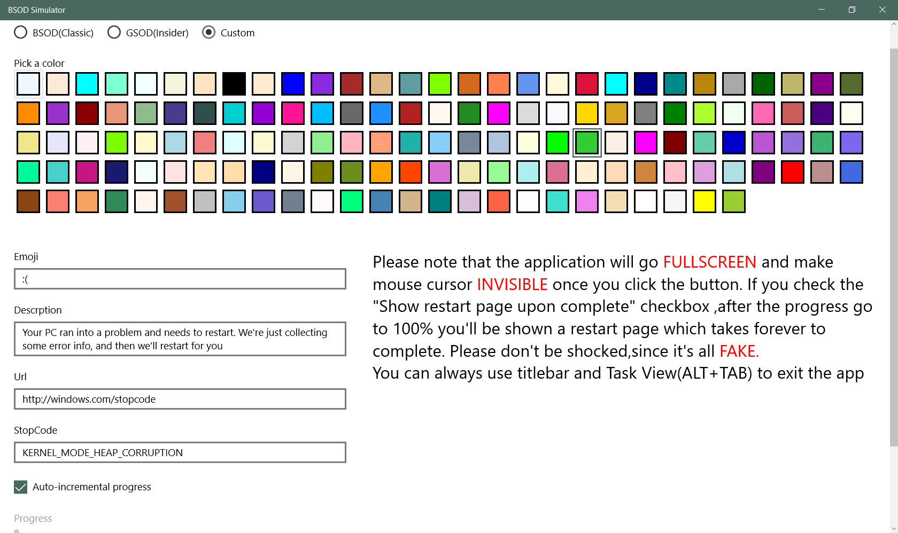
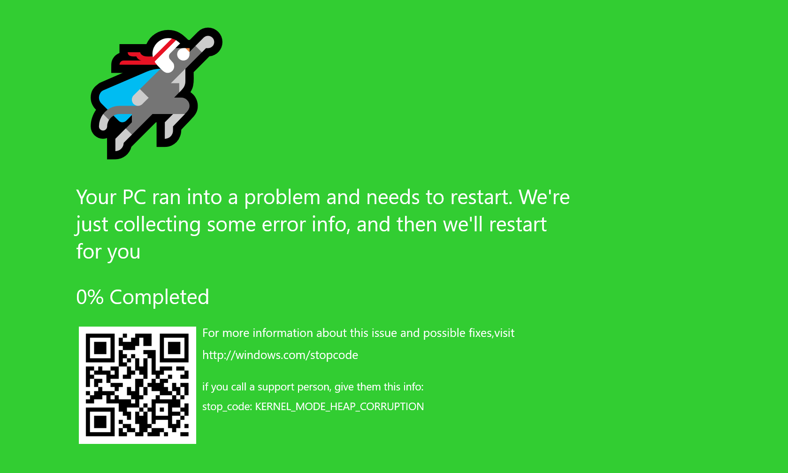

# BsodSimulator 蓝屏模拟器
A UWP program to customize your bug check experience.

一个自定义蓝屏的UWP程序

Build for fun and some extents of exercising on XAML layout.

一方面为了好玩，另一方面作为XAML布局的练习

Support for GSOD(green screen of death) which is available in build 15002 is included.

支持预览版15002的绿屏

Have fun 😋

玩得愉快 😋

### Changelog 更新记录

 1.2.0 [2017.9.23]

Fix a issue cause customization not showing on BSOD page after enting BSOD page multiple times.

修复多次进入蓝屏页面后自定义文本不显示的问题。

QRCode use selected color as foreground and  contains the link in URL field. Use a QRCode reader see for yourself.

生成的二维码使用选中的颜色作为前景色，并且用URL文本框中的链接作为内容。你可以扫码试一试

---

===

